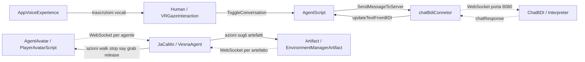
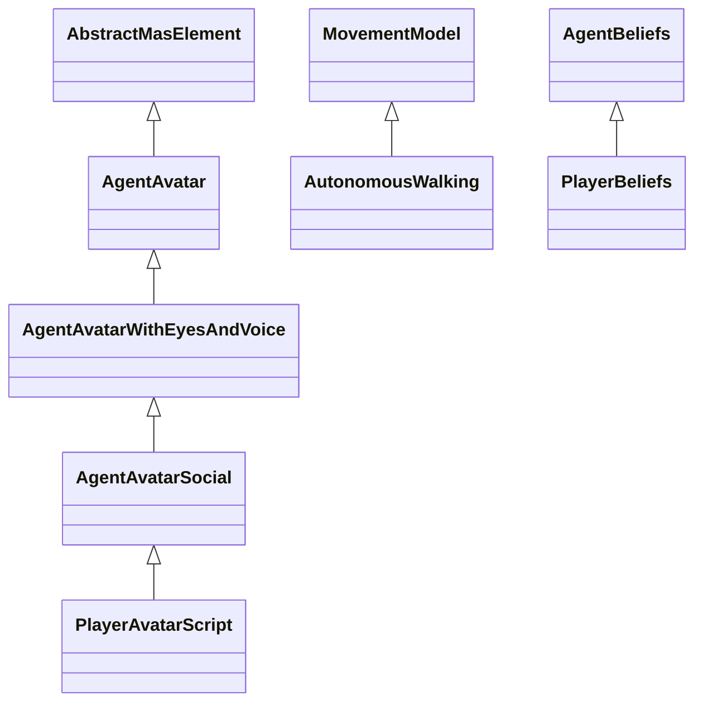
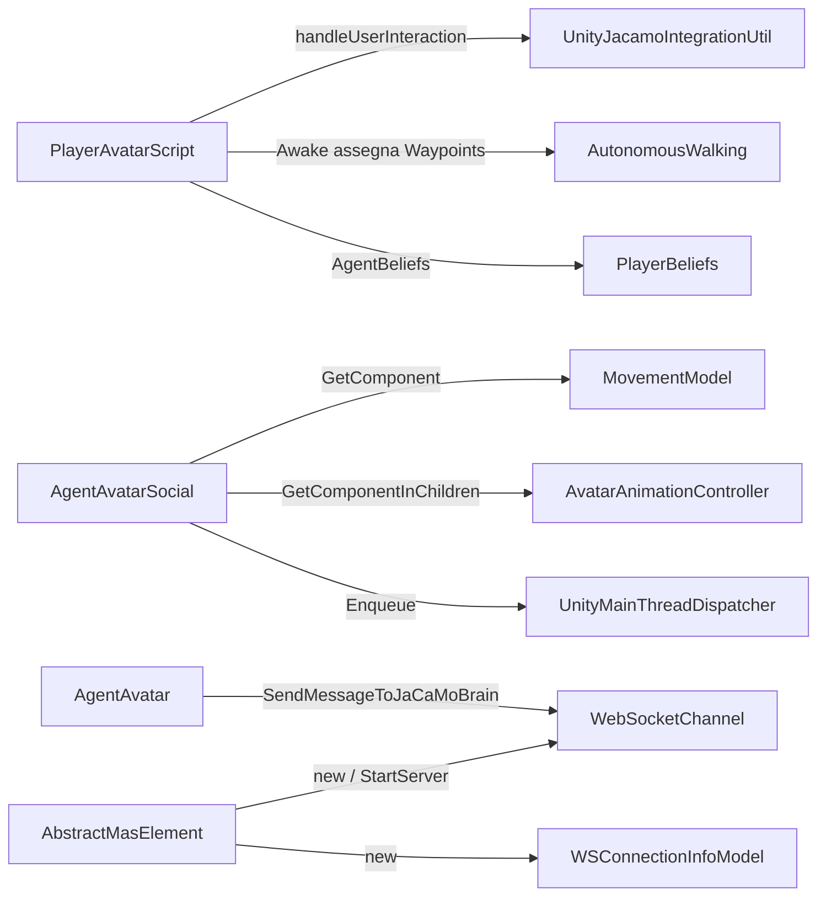
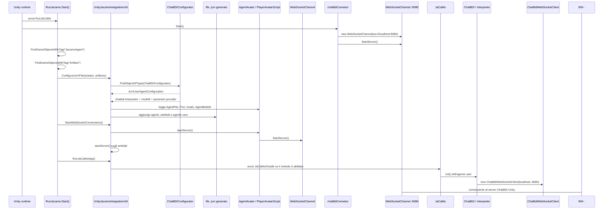
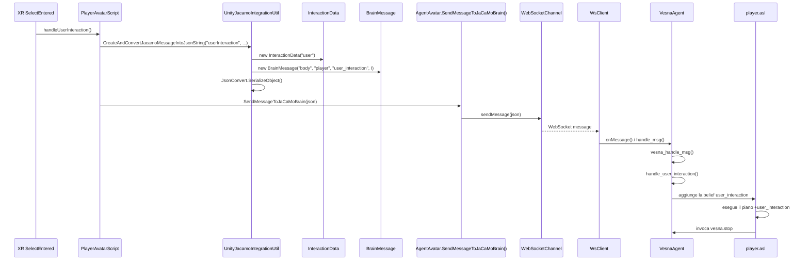
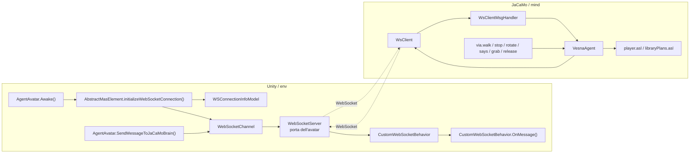
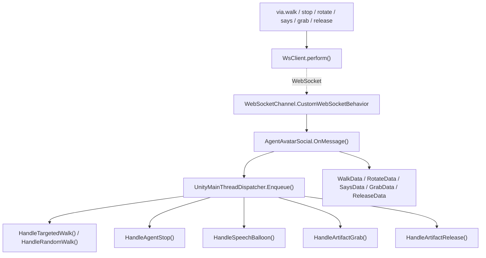
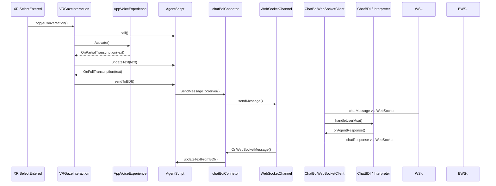
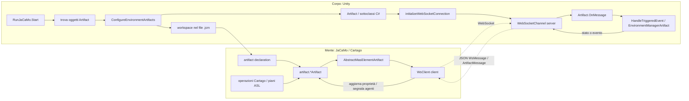
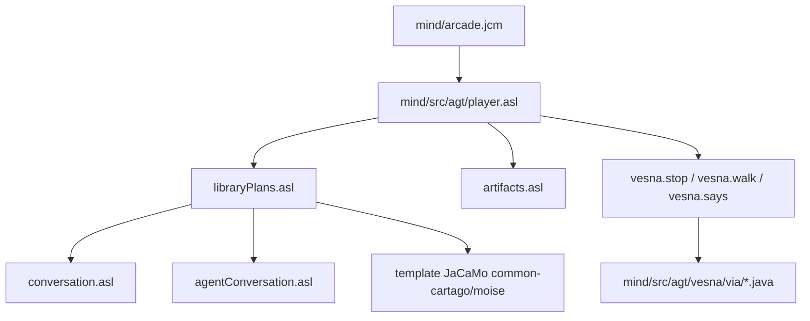

# Architettura della libreria Arcade

Questo documento descrive il percorso principale del progetto, concentrandosi su agenti, artefatti, interazione umana tramite voce e ChatBDI.

```text
Human / AppVoiceExperience
  -> AgentScript
  -> ChatBDI via WebSocket

Agenti JaCaMo / artefatti Unity
  -> WebSocketChannel
  -> client WebSocket JaCaMo
  -> agenti ASL e azioni Java
  -> messaggi di ritorno verso Unity
```

## Legenda

- `<|--`: ereditarietà; la punta indica la superclasse
- `-->`: chiamata o utilizzo diretto
- `-.->`: collegamento tramite protocollo o callback
- `..>`: file incluso/configurato

## 1. Attori e collegamenti principali



Il ramo `AgentScript` è separato dalla gerarchia `AgentAvatar`: gestisce la conversazione vocale con ChatBDI, mentre `AgentAvatar` gestisce il comportamento degli agenti JaCaMo.

## 2. Gerarchia C# e chiamate



Le chiamate esterne alla gerarchia sono mostrate separatamente:



### File e funzioni della gerarchia

| File | Funzioni o relazioni rilevanti |
|---|---|
| `avatar/PlayerAvatarScript.cs` | `Awake()`, `handleUserInteraction()`, proprietà `AgentBeliefs` |
| `avatar/AgentAvatarSocial.cs` | `Awake()`, `OnMessage()`, `HandleTargetedWalk()`, `HandleRandomWalk()`, `HandleAgentStop()`, `HandleRotateMessage()`, `HandleSpeechBalloon()`, `HandleArtifactGrab()` |
| `avatar/AgentAvatarWithEyesAndVoice.cs` | `Awake()`, `initializeAvatarWithEyes()`, `SetBaloonText()`, `EnableDisableVisionCone()`, `OnMessage()` |
| `avatar/AgentAvatar.cs` | `Awake()`, `ReachDestination()`, `SendMessageToJaCaMoBrain()`, `OnMessage()`, `HandleArtifactGrab()`, `HandleArtifactRelease()` |
| `core/AbstractMasElement.cs` | `initializeWebSocketConnection()`, `startServer()` |
| `avatar/AutonomousWalking.cs` | `Start()`, `StartWalking()`, `WalkRoutine()`, `Walk()` |
| `avatar/MovementModel.cs` | contratto astratto `StartWalking()` |
| `core/model/PlayerBeliefs.cs` | `GetBeliefsAsLiterals()`; produce `budget`, `tokens`, `token_price`, `friends` |
| `core/model/AgentBeliefs.cs` | contratto astratto `GetBeliefsAsLiterals()` |
| `core/enum/GoalEnum.cs` | valori configurati per l'agente e trasformati in goal ASL |
| `avatar/AvatarAnimationController.cs` | `SetAnimationState()`, `SetSpeed()` |

## 3. Avvio dell'applicazione



Configurazione ChatBDI durante l'avvio:

1. `UnityJacamoIntegrationUtil.ConfigureJcmFile()` cerca `ChatBDIConfigurator`.
2. `ChatBDIConfigurator.JcmUserAgentConfiguration` genera la definizione dell'agente `user` con architettura `chatbdi.Interpreter`.
3. La stessa configurazione inserisce nel file `.jcm` i provider, i modelli, gli endpoint e i percorsi dei prompt ChatBDI.
4. Quando JaCaMo esegue l'agente `user`, `Interpreter.init()` crea `ChatBdiWebSocketClient` e lo collega al server Unity sulla porta `8080`.

Nota sullo stato attuale del codice: `RunJaCaMoApp()` contiene un `return` immediato prima dell'avvio del processo Gradle. Quindi `ConfigureJcmFile()` prepara correttamente ChatBDI nel file `.jcm`, ma l'avvio effettivo di JaCaMo e di `ChatBdiWebSocketClient` non avviene da questo metodo finché quel `return` resta presente.

File coinvolti:

- `env/Assets/script/core/RunJaCaMo.cs`
  - `Start()` trova avatar e artefatti e coordina l'avvio.
- `env/Assets/script/core/util/UnityJacamoIntegrationUtil.cs`
  - `ConfigureJcmFile()` genera agenti e workspace.
  - `GenerateAgentsContent()` itera gli avatar.
  - `BuildAgentDefinition()` legge `AgentFile`, `port`, `Goals`, `AgentBeliefs`.
  - `ConfigureEnvironmentArtifacts()` genera gli artefatti JaCaMo.
  - `StartWebSocketConnections()` chiama `startServer()` su avatar e artefatti.
  - `RunJaCaMoApp()` prepara l'avvio JaCaMo.
- `env/Assets/script/core/util/ChatBDIConfigurator.cs`
  - proprietà `JcmUserAgentConfiguration` per l'agente `user`.
- `mind/arcade.jcm`
  - configurazione JaCaMo statica di riferimento.

## 4. Flusso di interazione del player verso JaCaMo



File e funzioni:

- `PlayerAvatarScript.handleUserInteraction()`
- `UnityJacamoIntegrationUtil.CreateAndConvertJacamoMessageIntoJsonString()`
- `InteractionData.InteractionData()`
- `BrainMessage.BrainMessage()`
- `AgentAvatar.SendMessageToJaCaMoBrain()`
- `WebSocketChannel.sendMessage()`
- `mind/src/agt/vesna/WsClient.onMessage()`
- `mind/src/agt/vesna/VesnaAgent.vesna_handle_msg()`
- `mind/src/agt/vesna/VesnaAgent.handle_user_interaction()`
- piano `+user_interaction` in `mind/src/agt/player.asl`
- `mind/src/agt/vesna/via/stop.execute()` per il comando di ritorno verso Unity

## 5. Server WebSocket Unity e client JaCaMo



File Unity:

- `env/Assets/script/core/WebSocketChannel.cs`
  - costruttori `WebSocketChannel()`
  - `StartServer()`
  - `sendMessage()`
  - `CustomWebSocketBehavior.OnMessage()`
- `env/Assets/script/core/model/WSConnectionInfoModel.cs`
  - costruttore, `getUrl()`, `getName()`.
- `env/Assets/script/core/AbstractMasElement.cs`
  - crea il server per ogni avatar/artefatto.
- `env/Assets/script/avatar/AgentAvatar.cs`
  - invia messaggi con `SendMessageToJaCaMoBrain()`.
- `env/Assets/script/avatar/AgentAvatarSocial.cs`
  - riceve e gestisce messaggi `walk`, `stop`, `rotate`, `say`, `grab`, `release`.

File JaCaMo/Java:

- `mind/src/agt/vesna/VesnaAgent.java`
  - `loadInitialAS()` crea e connette `WsClient`.
  - `perform()` invia azioni al body Unity.
  - `vesna_handle_msg()` interpreta i messaggi ricevuti.
  - `handle_user_interaction()`, `handle_movement()`, `handle_sight()`, `handle_door()`, `handle_arts()` aggiornano le belief.
- `mind/src/agt/vesna/WsClient.java`
  - `onMessage()` inoltra i messaggi a `WsClientMsgHandler`.
  - `onError()` inoltra gli errori.
- `mind/src/agt/vesna/WsClientMsgHandler.java`
  - callback `handle_msg()` e `handle_error()`.
- `mind/src/agt/vesna/via/walk.java`
  - `execute()` costruisce un JSON `type: walk`.
- `mind/src/agt/vesna/via/stop.java`
  - `execute()` costruisce un JSON `type: stop`.
- `mind/src/agt/vesna/via/rotate.java`
  - `execute()` costruisce un JSON `type: rotate`.
- `mind/src/agt/vesna/via/says.java`
  - `execute()` costruisce un JSON `type: say`.
- `mind/src/agt/vesna/via/grab.java`
  - `execute()` costruisce un JSON `type: grab`.
- `mind/src/agt/vesna/via/release.java`
  - `execute()` costruisce un JSON `type: release`.

## 6. Messaggi ricevuti dal player



Modelli JSON usati dal ramo di ritorno:

- `env/Assets/script/core/model/io/WsMessage.cs`
- `env/Assets/script/core/model/io/WalkData.cs`
- `env/Assets/script/core/model/io/RotateData.cs`
- `env/Assets/script/core/model/io/SaysData.cs`
- `env/Assets/script/core/model/io/GrabData.cs`
- `env/Assets/script/core/model/io/ReleaseData.cs`
- `env/Assets/script/core/util/MessageTypes.cs`
- `env/Assets/script/core/util/UnityMainThreadDispatcher.cs`

## 7. Ramo ChatBDI, Human e AppVoiceExperience

Questo ramo è parallelo al messaggio `user_interaction` di JaCaMo.



Il ciclo della voce è questo:

1. `VRGazeInteraction.ToggleConversation()` seleziona l'agente e chiama `AgentScript.call()`.
2. `VRGazeInteraction.ActivateAgent()` attiva `AppVoiceExperience`.
3. Gli eventi `OnPartialTranscription` e `OnFullTranscription` richiamano rispettivamente `OnTranscriptionDetected()` e `OnFullTranscriptionDetected()`.
4. La trascrizione completa viene inviata a `AgentScript.sendToBDI()`; le parole di chiusura disattivano l'agente, mentre le parole di annullamento richiamano `AgentScript.CancelText()`.
5. La risposta `chatResponse` torna a Unity e `AgentScript.updateTextFromBDI()` aggiorna il testo dell'agente.

File Unity:

- `env/Assets/script/Human/HumanScript.cs`
  - `ToggleConversation()`, `ActivateAgent()`, `DeactivateAgent()`.
  - `OnTranscriptionDetected()`, `OnFullTranscriptionDetected()`.
- `env/Assets/script/avatar/AgentScript.cs`
  - `call()`, `endCall()`, `updateText()`, `sendToBDI()`, `updateTextFromBDI()`.
- `env/Assets/scripts/raycast scripts/chatBdiConnetor.cs`
  - `Start()`, `Update()`, `OnWebSocketMessage()`, `SendMessageToServer()`.
- `env/Assets/script/core/model/io/ArtifactMessage.cs`
  - modello dei messaggi `chatMessage` e `chatResponse`.
- `env/Assets/script/core/util/ChatBDIConfigurator.cs`
  - espone `JcmUserAgentConfiguration`, che configura l'agente `user` con l'architettura `chatbdi.Interpreter` e i parametri dei modelli.
- `env/Assets/voiceApp.asset`
  - configurazione dell'esperienza vocale assegnata al campo `VRGazeInteraction.appVoiceExperience`.

File Java ChatBDI:

- `mind/src/agt/chatbdi/Interpreter.java`
  - inizializza il client ChatBDI sulla porta `8080` e inoltra le risposte al listener.
- `mind/src/agt/chatbdi/ChatBdiWebSocketClient.java`
  - `start()` apre la connessione verso Unity.
  - `handleIncomingMessage()` legge `chatMessage`, estrae i destinatari `@agent` e chiama `Interpreter.handleUserMsg()`.
  - `onAgentResponse()` serializza e invia `chatResponse` a Unity.
- `mind/src/agt/chatbdi/ChatBdiResponseListener.java`
  - contratto `onAgentResponse(agent, message)` per il ritorno della risposta.

## 8. Artefatti e workspace JaCaMo

`RunJaCaMo` non avvia solo il player: raccoglie tutti gli oggetti con tag `Artifact` e apre un server WebSocket per ciascuno.



File direttamente utilizzati da questo ramo:

- `env/Assets/script/environment/AbstractArtifact.cs`
- `env/Assets/script/environment/Artifact.cs`
- `env/Assets/script/environment/EnvironmentManagerArtifact.cs`
- `env/Assets/script/environment/DoorScript.cs`
- `env/Assets/script/environment/CounterScript.cs`
- `env/Assets/script/environment/TokenMachineScript.cs`
- `env/Assets/script/environment/SinglePlayerGameScript.cs`
- `env/Assets/script/environment/Artifacts/SnapPointArtifact.cs`
- `env/Assets/script/core/model/io/ArtifactMessage.cs`
- `env/Assets/script/core/model/io/ArtsData.cs`
- `env/Assets/script/core/model/io/DoorData.cs`
- `env/Assets/script/core/model/io/SightData.cs`
- `env/Assets/script/core/model/io/MoveData.cs`
- `env/Assets/script/core/AbstractMasElement.cs`
- `env/Assets/script/core/WebSocketChannel.cs`
- `env/Assets/script/core/util/UnityJacamoIntegrationUtil.cs`
- `mind/src/env/artifact/lib/maselements/AbstractMasElement.java`
- `mind/src/env/artifact/lib/maselements/AbstractMasElementArtifact.java`
- `mind/src/env/artifact/lib/websocket/WsClient.java`
- `mind/src/env/artifact/lib/model/WsMessage.java`
- `mind/src/env/artifact/lib/utils/ObjectMapperUtils.java`
- `mind/src/env/artifact/GenericArtifact.java`
- `mind/src/env/artifact/EnvManagerArtifact.java`
- `mind/src/env/artifact/GrabbableArtifact.java`
- `mind/src/env/artifact/DoorArtifact.java`
- `mind/src/env/artifact/TokenMachineArtifact.java`
- `mind/src/env/artifact/SinglePlayerGameArtifact.java`
- `mind/src/env/artifact/SnapPointArtifact.java`

### Mente e corpo dello stesso artefatto

Ogni artefatto ha due rappresentazioni collegate:

- il `corpo` è l'oggetto Unity, gestito da `Artifact.cs` e dalle sottoclassi (`DoorScript`, `TokenMachineScript`, `SinglePlayerGameScript` e altre); contiene lo stato e reagisce agli eventi fisici o dell'interfaccia;
- la `mente` è l'artefatto Cartago Java (`DoorArtifact`, `TokenMachineArtifact`, `GrabbableArtifact`, `EnvManagerArtifact`...), che espone operazioni, proprietà osservabili e segnali per gli agenti;
- `WebSocketChannel` sul lato Unity e `WsClient` sul lato JaCaMo sono il ponte bidirezionale;
- `WsMessage`, `ArtifactMessage` e `BrainMessage` sono i contenitori JSON usati per trasportare comandi, stati e risultati; il formato deve corrispondere al tipo di endpoint che riceve il messaggio.

Il flusso generale è:

1. `RunJaCaMo.Start()` raccoglie gli oggetti con tag `Artifact`.
2. `ConfigureEnvironmentArtifacts()` usa `ArtifactType` e `ArtifactProperties` per generare le dichiarazioni degli artefatti nel workspace `.jcm`.
3. `Artifact.Awake()` crea il `WebSocketChannel`; `StartWebSocketConnections()` avvia il server Unity per ogni artefatto.
4. Quando JaCaMo istanzia l'artefatto Java, `AbstractMasElementArtifact.init()` crea il `WsClient` e si collega alla porta del corpo Unity.
5. Un'operazione Cartago o un piano ASL invia un JSON al corpo; `Artifact.OnMessage()` lo deserializza e delega alla sottoclasse.
6. Un evento Unity o una richiesta del corpo produce una risposta JSON; l'artefatto Java la riceve in `onMessageReceived()`, aggiorna le proprietà osservabili e segnala gli agenti.

Esempi di comunicazione:

- `EnvManagerArtifact.retrieveAllArtifacts()`, `retrieveArtifactsByType()` e `retrieveNearestArtifactByType()` inviano rispettivamente `all_artifact`, `all_artifact_by_type` e `nearest`. `EnvironmentManagerArtifact` interroga gli oggetti Unity e risponde con `artifactStrategy` e `ArtsData.names`; `EnvManagerArtifact.onMessageReceived()` inoltra i nomi all'agente richiedente.
- `GrabbableArtifact` invia `grabbableStatus/is_grabbable`; `Artifact.RetrieveGrabbableStatus()` legge `isGrabbable` dal corpo e restituisce `grabbable_status`. Gli eventi `grabbed` e `released` aggiornano poi `isAvailable` e `currentOwner` nella mente.
- `TokenMachineArtifact` e `SinglePlayerGameArtifact` inviano `artifactAction/triggered` con un `agentEvent`; `TokenMachineScript.HandleTriggeredEvent()` e `SinglePlayerGameScript.HandleTriggeredEvent()` applicano l'azione sul corpo Unity.
- `DoorScript` invia lo stato `supermarketDoorStatus`; `DoorArtifact.onMessageReceived()` dovrebbe aggiornare la proprietà osservabile `isDoorOpen` e segnalare il cambiamento tramite `signalAgentsByTick()`. Nel codice attuale Unity serializza questo messaggio come `BrainMessage` (`type: door`), mentre `DoorArtifact` lo legge come `WsMessage`: questo formato va allineato perché il flusso funzioni correttamente.

## 9. File ASL inclusi



Nota: `mind/src/agt/vesna.asl` non è incluso da `player.asl`; il collegamento operativo del player avviene tramite `VesnaAgent.java` e le azioni Java nella cartella `via`.
